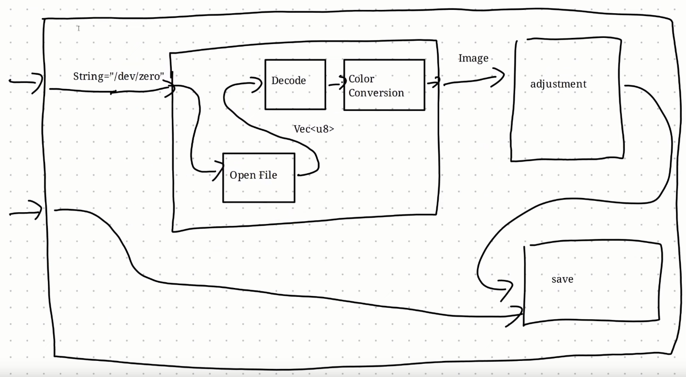
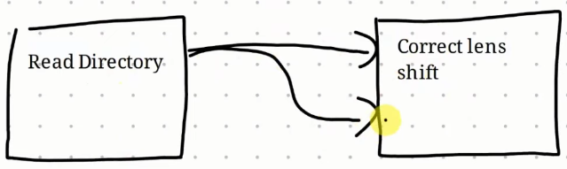
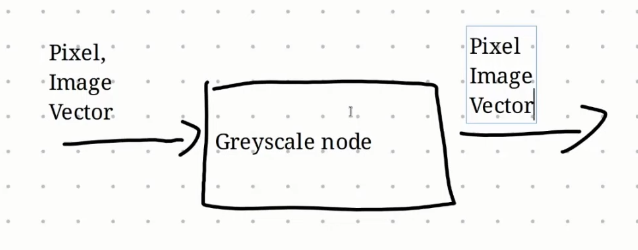

> Notes from the [Graphene Language Explainer](https://www.youtube.com/watch?v=Q5yibBN3U1k) video

* Node <==> Rust Function
* Nodes are **idempotent**
  - slightly weaker condition than purity 
  - used for cache invalidation

Goal:  Restrict the user as little as possible
  - focus on primitives that are useful for building larger operations

Nodes can either be:

* **Atomic:** Corresponding to an ordinary Rust function
* **`DocumentNode`:** A network of other nodes.



Nodes have **inputs**:

* Supports default values

In the case of batch processing we might want to pass a `Vec<T>` to a node that takes `T` as input:



Compiled vs JIT vs Interpreted...

There is a `Node` trait (`gcore/src/lib.rs`)

```rust
// pub trait Node: for<'n> NodeIO<'n> {
/// The node trait allows for defining any node. Nodes can only take one call argument input, however they can store references to other nodes inside the struct.
/// See `node-graph/README.md` for information on how to define a new node.
pub trait Node<'i, Input> {
	type Output: 'i;
	/// Evaluates the node with the single specified input.
	fn eval(&'i self, input: Input) -> Self::Output;
	/// Resets the node, e.g. the LetNode's cache is set to None.
	fn reset(&self) {}
	/// Returns the name of the node for diagnostic purposes.
	fn node_name(&self) -> &'static str {
		std::any::type_name::<Self>()
	}
	/// Serialize the node which is used for the `introspect` function which can retrieve values from monitor nodes.
	fn serialize(&self) -> Option<std::sync::Arc<dyn std::any::Any + Send + Sync>> {
		log::warn!("Node::serialize not implemented for {}", std::any::type_name::<Self>());
		None
	}
}
```

